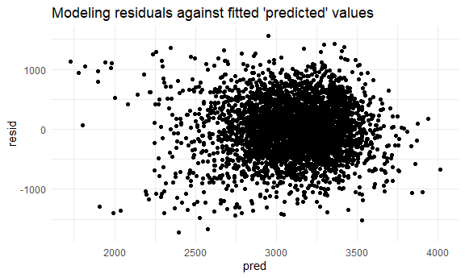

Homework 6
================

``` r
library(tidyverse)
```

    ## -- Attaching packages -------------------------------------------------------------------- tidyverse 1.3.0 --

    ## v ggplot2 3.3.2     v purrr   0.3.4
    ## v tibble  3.0.3     v dplyr   1.0.2
    ## v tidyr   1.1.2     v stringr 1.4.0
    ## v readr   1.3.1     v forcats 0.5.0

    ## Warning: package 'ggplot2' was built under R version 4.0.3

    ## -- Conflicts ----------------------------------------------------------------------- tidyverse_conflicts() --
    ## x dplyr::filter() masks stats::filter()
    ## x dplyr::lag()    masks stats::lag()

``` r
library(modelr)

knitr::opts_chunk$set(
  fig.width = 6, 
  fig.asp = .6,
  out.width = "90%"
)

theme_set(theme_minimal() + theme(legend.position = "bottom"))

options(
  ggplot2.continuous.colour = "viridis", 
  ggplot2.continuous.fill = "viridis"
)

scale_colour_discrete = scale_colour_viridis_d
scale_fill_discrete = scale_fill_viridis_d
```

## Problem 1

Read in and prepare data:

Created city\_state variable and binary ‘solved/unsolved’ homicide
variable indicating whether the homicide is solved. Limited analysis to
those for whom victim\_race is white or black.

``` r
homicide_df = 
  read.csv("./data/homicide-data.csv", na = c("", "NA", "Unknown")) %>% 
  janitor::clean_names() %>% 
  # add city_state variable
  unite("city_state", city:state, sep = ", ", remove = TRUE) %>%
  # add homicide solved variable 
  mutate(
    resolved = case_when(
      disposition == "Closed without arrest" ~ 0,
      disposition == "Open/No arrest"        ~ 0,
      disposition == "Closed by arrest"      ~ 1),
    victim_age = as.numeric(victim_age)
  ) %>% 
  # omit Dallas, Phoenix, Kansas City, and Tulsa, AZ
  filter(city_state != "Dallas, TX", city_state != "Phoenix, AZ", city_state != "Kansas City, MO", city_state != "Tulsa, AL") %>% 
  filter(victim_race %in% c("White", "Black")) %>% 
  # changing reference group so that OR in log reg models are 
  # comparing Black victims to white victims 
  mutate(victim_race = fct_relevel(victim_race, "White", "Black"))
```

Baltimore, MD - logistic regression model with resolved vs unresolved as
outcome and victim age, sex and race as predictors.

``` r
baltimore_df = 
  homicide_df %>% 
  filter(city_state == "Baltimore, MD")

glm(resolved ~ victim_age + victim_sex + victim_race, 
    data = baltimore_df, 
    family = binomial()) %>% 
  broom::tidy() %>% 
  mutate(
    OR = exp(estimate),
    CI_lower = exp(estimate - 1.96 * std.error),
    CI_upper = exp(estimate + 1.96 * std.error)
  ) %>% 
  select(term, OR, starts_with("CI")) %>% 
  knitr::kable(digits = 4)
```

| term              |     OR | CI\_lower | CI\_upper |
| :---------------- | -----: | --------: | --------: |
| (Intercept)       | 3.1637 |    1.9892 |    5.0315 |
| victim\_age       | 0.9933 |    0.9868 |    0.9998 |
| victim\_sexMale   | 0.4255 |    0.3246 |    0.5579 |
| victim\_raceBlack | 0.4310 |    0.3060 |    0.6069 |

The estimated odds of resolving homicides in Baltimore for Black victims
is 0.43 times the odds of resolved homicides for white victims. We are
95% confident that this OR lies between 0.31 and 0.61.

Run glm for each of the cities in your dataset, and extract the adjusted
odds ratio (and CI) for solving homicides comparing Black victims to
white victims.

``` r
model_resuls_df = 
  homicide_df %>% 
  nest(data = -city_state) %>% 
  mutate(
    models = 
      map(.x = data, 
          ~glm(resolved ~ victim_age + victim_sex + victim_race, 
               data = .x, 
               family = binomial())),
    results = map(models, broom::tidy)
  ) %>% 
  select(city_state, results) %>% 
  unnest(results) %>% 
    mutate(
    OR = exp(estimate),
    CI_lower = exp(estimate - 1.96 * std.error),
    CI_upper = exp(estimate + 1.96 * std.error)
  ) %>% 
  select(city_state, term, OR, starts_with("CI"))

# Extracted OR for each city comparing homicide 
# resolution for Black victims compared to white victims

model_resuls_df %>% 
  filter(term == "victim_raceBlack") %>% 
  knitr::kable(digit = 4)
```

| city\_state        | term              |     OR | CI\_lower | CI\_upper |
| :----------------- | :---------------- | -----: | --------: | --------: |
| Albuquerque, NM    | victim\_raceBlack | 0.6623 |    0.2928 |    1.4977 |
| Atlanta, GA        | victim\_raceBlack | 0.7643 |    0.4378 |    1.3345 |
| Baltimore, MD      | victim\_raceBlack | 0.4310 |    0.3060 |    0.6069 |
| Baton Rouge, LA    | victim\_raceBlack | 0.6395 |    0.2980 |    1.3722 |
| Birmingham, AL     | victim\_raceBlack | 1.0704 |    0.6331 |    1.8097 |
| Boston, MA         | victim\_raceBlack | 0.0939 |    0.0380 |    0.2325 |
| Buffalo, NY        | victim\_raceBlack | 0.3830 |    0.2075 |    0.7071 |
| Charlotte, NC      | victim\_raceBlack | 0.6313 |    0.3604 |    1.1060 |
| Chicago, IL        | victim\_raceBlack | 0.5625 |    0.4302 |    0.7354 |
| Cincinnati, OH     | victim\_raceBlack | 0.3211 |    0.1853 |    0.5565 |
| Columbus, OH       | victim\_raceBlack | 0.8490 |    0.6279 |    1.1481 |
| Denver, CO         | victim\_raceBlack | 0.5642 |    0.3125 |    1.0184 |
| Detroit, MI        | victim\_raceBlack | 0.6527 |    0.4888 |    0.8717 |
| Durham, NC         | victim\_raceBlack | 1.0235 |    0.4099 |    2.5561 |
| Fort Worth, TX     | victim\_raceBlack | 0.9390 |    0.5970 |    1.4770 |
| Fresno, CA         | victim\_raceBlack | 0.4599 |    0.2166 |    0.9765 |
| Houston, TX        | victim\_raceBlack | 0.9414 |    0.7453 |    1.1891 |
| Indianapolis, IN   | victim\_raceBlack | 0.4921 |    0.3709 |    0.6530 |
| Jacksonville, FL   | victim\_raceBlack | 0.6463 |    0.4925 |    0.8481 |
| Las Vegas, NV      | victim\_raceBlack | 0.7770 |    0.5779 |    1.0446 |
| Long Beach, CA     | victim\_raceBlack | 1.0494 |    0.4724 |    2.3309 |
| Los Angeles, CA    | victim\_raceBlack | 0.5784 |    0.4098 |    0.8163 |
| Louisville, KY     | victim\_raceBlack | 0.3987 |    0.2630 |    0.6044 |
| Memphis, TN        | victim\_raceBlack | 0.8046 |    0.5377 |    1.2040 |
| Miami, FL          | victim\_raceBlack | 0.5807 |    0.3748 |    0.8996 |
| Milwaukee, wI      | victim\_raceBlack | 0.5940 |    0.3773 |    0.9352 |
| Minneapolis, MN    | victim\_raceBlack | 0.6091 |    0.3214 |    1.1544 |
| Nashville, TN      | victim\_raceBlack | 0.8695 |    0.6306 |    1.1989 |
| New Orleans, LA    | victim\_raceBlack | 0.4462 |    0.2812 |    0.7081 |
| New York, NY       | victim\_raceBlack | 0.4512 |    0.2299 |    0.8856 |
| Oakland, CA        | victim\_raceBlack | 0.1808 |    0.0881 |    0.3714 |
| Oklahoma City, OK  | victim\_raceBlack | 0.6986 |    0.4744 |    1.0288 |
| Omaha, NE          | victim\_raceBlack | 0.1368 |    0.0751 |    0.2492 |
| Philadelphia, PA   | victim\_raceBlack | 0.6468 |    0.4870 |    0.8589 |
| Pittsburgh, PA     | victim\_raceBlack | 0.2793 |    0.1593 |    0.4898 |
| Richmond, VA       | victim\_raceBlack | 0.4964 |    0.1792 |    1.3749 |
| San Antonio, TX    | victim\_raceBlack | 0.7454 |    0.4556 |    1.2197 |
| Sacramento, CA     | victim\_raceBlack | 0.7641 |    0.4145 |    1.4086 |
| Savannah, GA       | victim\_raceBlack | 0.5856 |    0.2745 |    1.2494 |
| San Bernardino, CA | victim\_raceBlack | 0.9869 |    0.4068 |    2.3939 |
| San Diego, CA      | victim\_raceBlack | 0.4867 |    0.2765 |    0.8567 |
| San Francisco, CA  | victim\_raceBlack | 0.4206 |    0.2588 |    0.6836 |
| St. Louis, MO      | victim\_raceBlack | 0.5758 |    0.4048 |    0.8190 |
| Stockton, CA       | victim\_raceBlack | 0.4486 |    0.2183 |    0.9220 |
| Tampa, FL          | victim\_raceBlack | 1.2359 |    0.6154 |    2.4819 |
| Tulsa, OK          | victim\_raceBlack | 0.5907 |    0.3978 |    0.8771 |
| Washington, DC     | victim\_raceBlack | 0.5210 |    0.2627 |    1.0334 |

Plot that shows estimated ORs and CIs for each city (OR of resolution
Male vs Female homicide victims)

``` r
model_resuls_df %>% 
  filter(term == "victim_sexMale") %>% 
  mutate(city_state = fct_reorder(city_state, OR)) %>% 
  ggplot(aes(x = city_state, y = OR)) +
  geom_point() +
  geom_errorbar(aes(ymin = CI_lower, ymax = CI_upper)) + 
  theme(axis.text = element_text(angle = 90, hjust = 1))
```


From this plot we can see that the majority of OR estimates are less
than 1, meaning that homicides with male victims generally have lower
odds of being resolved by arrest.

## Problem 2

Read and clean birthweight dataset:

``` r
bw_df =
  read.csv("./data/birthweight.csv") %>% 
  janitor::clean_names() %>% 
  mutate(
    babysex = as.factor(babysex),
    malform = as.factor(malform),
    mrace = as.factor(mrace),
    mrace = case_when(
      mrace == 1      ~ "white",
      mrace == 2      ~ "black",
      mrace == 3     ~ "asian",
      mrace == 4      ~ "peurto rican",
      mrace == 8      ~ "other")
    ) %>% 
  mutate(
    mrace = fct_relevel(mrace, "white")
  )

# Checking for missing values
any(is.na(bw_df))
```

    ## [1] FALSE

Propose model for birthweight:

The hypothesized predictors that I wanted to explore in their potential
contribution to birthweight are: 1) Gestational age 2) Maternal race 3)
Family monthly income 4) Mother’s weight gain during pregnancy and 5)
Mother’s age at delivery. Knowing that gestational age does have an
impact on infant birthweight, I wanted to also introduce and examine
predictors that brought in environmental or socio-demographic factors -
like mother’s race and family SES (using family income in this dataset).
I used white mothers as the reference group in this model.

``` r
proposed_model_df = 
  lm(bwt ~ gaweeks + wtgain + fincome + momage + mrace, data = bw_df)

broom::glance(proposed_model_df)
```

    ## # A tibble: 1 x 12
    ##   r.squared adj.r.squared sigma statistic   p.value    df  logLik    AIC    BIC
    ##       <dbl>         <dbl> <dbl>     <dbl>     <dbl> <dbl>   <dbl>  <dbl>  <dbl>
    ## 1     0.260         0.259  441.      217. 1.54e-277     7 -32595. 65209. 65266.
    ## # ... with 3 more variables: deviance <dbl>, df.residual <int>, nobs <int>

``` r
broom::tidy(proposed_model_df) %>% 
  select(term, estimate, std.error, p.value) %>% 
  knitr::kable(digit = 4)
```

| term              |   estimate | std.error | p.value |
| :---------------- | ---------: | --------: | ------: |
| (Intercept)       |   745.4480 |   94.1368 |  0.0000 |
| gaweeks           |    54.7086 |    2.1895 |  0.0000 |
| wtgain            |     9.2476 |    0.6224 |  0.0000 |
| fincome           |     0.5385 |    0.2881 |  0.0617 |
| momage            |     4.4863 |    1.9145 |  0.0192 |
| mraceasian        | \-123.8242 |   68.4397 |  0.0705 |
| mraceblack        | \-224.1064 |   15.7405 |  0.0000 |
| mracepeurto rican | \-129.8158 |   30.4439 |  0.0000 |

``` r
bw_df %>% 
  add_predictions(proposed_model_df) %>% 
  add_residuals(proposed_model_df) %>% 
  ggplot(aes(x = pred, y = resid))+
  geom_point() + 
  labs(title = "Modeling residuals against fitted 'predicted' values")
```



``` r
bw_df %>% 
  add_residuals(proposed_model_df) %>% 
  ggplot(aes(x = resid))+ 
  geom_density() +
  labs (title = "overall distribution of residuals")
```


``` r
bw_df %>% 
  add_residuals(proposed_model_df) %>% 
  ggplot(aes (x = mrace, y = resid)) + 
  geom_violin() + 
  labs(title = "distribution of residuals for maternal race categories")
```


After making a scatter plot comparing the residuals against predicted
valus for this model, I also made a density plot to get a better view of
how the residuals were behaving - which looks fairly normally
distributed. I also wanted to make a violin plot comparing the
distribution of residuals for each category of maternal race, as it’s
the only categorical variable in the model - which, overall, don’t look
too skewed.

Comparing proposed model to two others:

1.  Using length at birth and gestational age as predictors (main
    effects only)
2.  Using head circumference, length, sex, and all interactions
    (including the three-way interaction) between these

<!-- end list -->

``` r
main_eff_model = lm(bwt ~ blength + gaweeks, 
                    data = bw_df)

interaction_model = lm(bwt ~ bhead + blength + babysex + 
                         bhead*blength + bhead*babysex + blength*babysex +
               bhead*blength*babysex, 
               data = bw_df)

cross_df = 
  crossv_mc(bw_df, 100) %>% 
  mutate(
    train = map(train, as_tibble),
    test = map(test, as_tibble)
  )

cross_df = 
  cross_df %>% 
  mutate(
    proposed_model_df = map(.x = train, 
                            ~lm(bwt ~ gaweeks + wtgain + fincome + 
                                  momage + mrace, 
                                data = .x)),
    main_eff_model = map(.x = train,
                         ~lm(bwt ~ blength + gaweeks, data = .x)),
    interaction_model = map(.x = train,
                            ~lm(bwt ~ bhead + blength + babysex + 
                                  bhead*blength + bhead*babysex + blength*babysex +
                                  bhead*blength*babysex,
                                data = .x))
  ) %>% 
  mutate(
    rmse_proposed = 
      map2_dbl(.x = proposed_model_df, .y = test, 
               ~rmse(model = .x, data = .y)),
    rmse_main_eff = 
      map2_dbl(.x = main_eff_model, .y = test,
               ~rmse(model = .x, data = .y)),
    rmse_interaction = 
      map2_dbl(.x = interaction_model, .y = test, 
               ~rmse(model = .x, data = .y))
  )

cross_df %>% 
  select(starts_with("rmse")) %>% 
  pivot_longer(
    everything(),
    names_to = "model",
    values_to = "rmse",
    names_prefix = "rmse_"
    ) %>% 
  ggplot(aes(x = model, y = rmse)) +
  geom_violin(
  )
```


By looking at the above violin plots, we can see that model 3 (the
interaction model) has the lowest RMSE and so has the greatest
prediction accuracy. My proposed model, of the three, has the highest
RMSE and so has the least prediction accuracy.

## Problem 3

Reading in weather data:

``` r
weather_df = 
  rnoaa::meteo_pull_monitors(
    c("USW00094728"),
    var = c("PRCP", "TMIN", "TMAX"), 
    date_min = "2017-01-01",
    date_max = "2017-12-31") %>%
  mutate(
    name = recode(id, USW00094728 = "CentralPark_NY"),
    tmin = tmin / 10,
    tmax = tmax / 10) %>%
  select(name, id, everything())
```

    ## Registered S3 method overwritten by 'hoardr':
    ##   method           from
    ##   print.cache_info httr

    ## using cached file: C:\Users\hbrig\AppData\Local\Cache/R/noaa_ghcnd/USW00094728.dly

    ## date created (size, mb): 2020-10-05 18:45:50 (7.537)

    ## file min/max dates: 1869-01-01 / 2020-10-31

Focusing on simple linear regression with tmax as the response and tmin
as the predictor.
